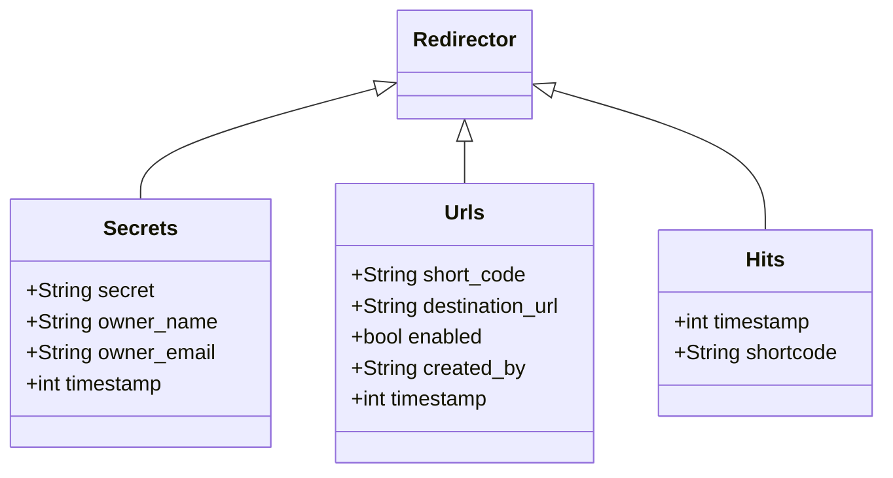

# Redirector de URLs

## Requerimientos

Vamos a crear un "redirector de URLs", un servicio parecido al que brinda [bit.ly](https://bit.ly).

Este servicio web tiene que tener un endpoint ("/r") que recibe un string como parametro, busca ese string en una tabla para obtener la URL de destino y devuelve un http 302 redirigiendo al cliente a la URL de destino. Si el string no figura en la tabla debemos devolver un mensaje de error y un error 404.

Queremos también que para todos los hits en "/r" se guarde un registro con timestamp y resultado (exito/error).

Queremos también que haya otro endpoint donde un usuario conociendo un secret key pueda crear nuevas redirecciones.

Queremos también que haya otro endpoint donde un usuario conociendo un secret key pueda ver las estadísticas de las redirecciones creadas con ese secret key.

## Endpoints

* /r
* /newr
* /stats
* /admin

## Modelos

